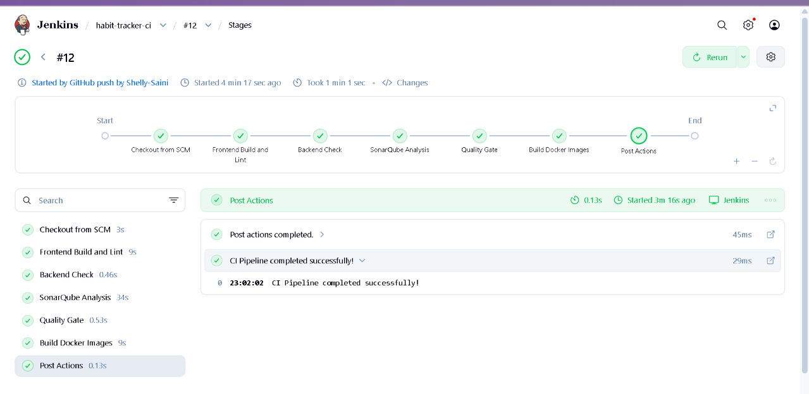
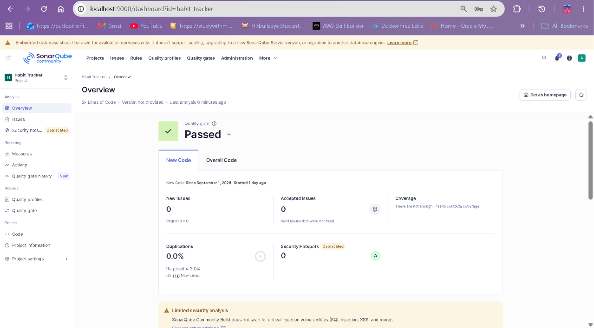
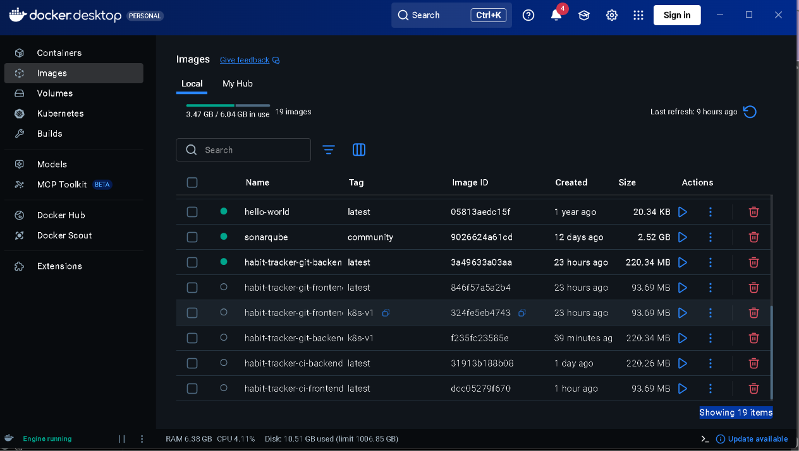
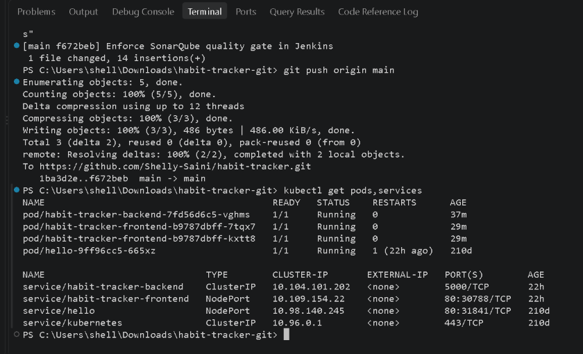
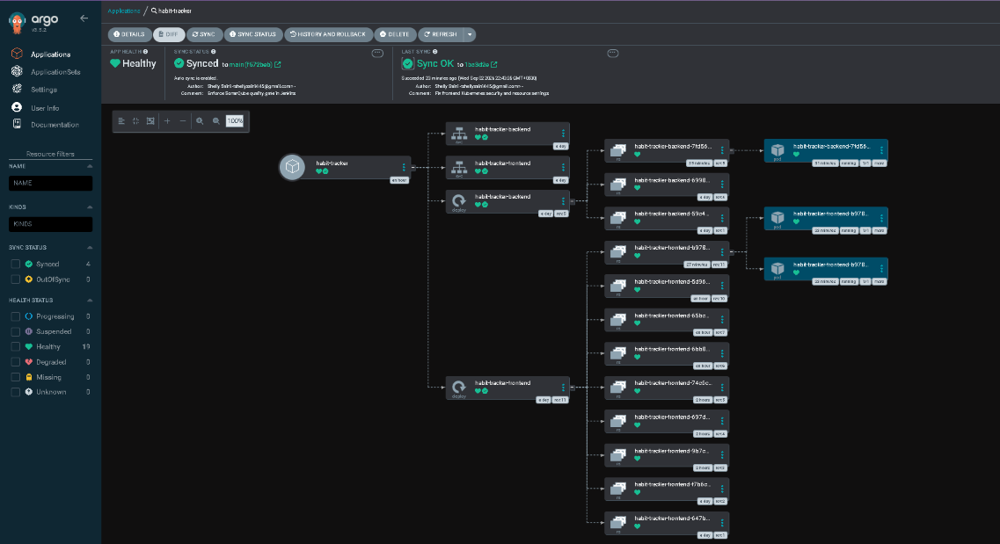

# 🚀 Habit Tracker — DevOps & GitOps CI/CD Pipeline

A full-stack Habit Tracker application built to showcase a **production-style CI/CD and GitOps workflow** using Jenkins, SonarQube, Docker, Kubernetes, Minikube, and Argo CD.

While the app itself is a simple habit-tracking tool, the primary goal of this project is to demonstrate a complete, real-world **DevOps pipeline** — from source code commit to automated, GitOps-driven deployment on Kubernetes.

---

## 📌 Table of Contents

- [Project Overview](#-project-overview)
- [Architecture](#️-architecture)
- [Application Stack](#application-stack)
- [DevOps / GitOps Stack](#devops--gitops-stack)
- [CI/CD Workflow — Jenkins](#-cicd-workflow--jenkins)
- [SonarQube Quality Gate](#-sonarqube-quality-gate)
- [Docker](#-docker)
- [Kubernetes](#️-kubernetes)
- [GitOps with Argo CD](#-gitops-with-argo-cd)
- [Project Structure](#-project-structure)
- [Security & Configuration](#-security--configuration)
- [Key DevOps Features](#️-key-devops-features)
- [Learning Outcomes](#-learning-outcomes)
- [Author](#-author)

---

## 🚀 Project Overview

Habit Tracker is a full-stack web application that allows users to create, manage, and track their daily habits. Beyond the application functionality, this project was built to implement and demonstrate a **practical, end-to-end DevOps workflow**, including:

- Continuous Integration with automated code quality enforcement
- Containerization of frontend and backend services
- Kubernetes-based orchestration with resource management and security hardening
- **GitOps-based Continuous Deployment** using Argo CD, where Git is the single source of truth for the cluster state

### Application Stack

- **Frontend:** React + Vite
- **Backend:** Node.js + Express
- **Database:** MongoDB
- **Web Server:** Nginx

### DevOps / GitOps Stack

| Tool | Purpose |
|---|---|
| **Git & GitHub** | Source code management & GitOps source of truth |
| **Jenkins** | Continuous Integration pipeline |
| **SonarQube** | Static code analysis & Quality Gate enforcement |
| **Docker** | Containerization of frontend & backend |
| **Kubernetes** | Container orchestration |
| **Minikube** | Local Kubernetes cluster for deployment |
| **Argo CD** | GitOps-based Continuous Deployment |

---

## 🏗️ Architecture

```text
                         GitHub
                           │
                           │ Push
                           ↓
                      ┌─────────┐
                      │ Jenkins │
                      └────┬────┘
                           │
              ┌────────────┼────────────┐
              ↓            ↓            ↓
        Build & Lint   SonarQube    Docker Build
              │            │
              │       Quality Gate
              │            │
              │       PASS / FAIL
              │            │
              └────────────┼────────────┘
                           │
                           ↓
                    Kubernetes Manifests
                           │
                           ↓
                       Argo CD
                           │
                     GitOps Sync
                           ↓
                    ┌────────────┐
                    │  Minikube  │
                    │ Kubernetes │
                    └─────┬──────┘
                          │
                 ┌────────┴────────┐
                 ↓                 ↓
             Frontend            Backend
              Nginx           Node + Express
                                    │
                                    ↓
                                 MongoDB
```

---

## 🔄 CI/CD Workflow — Jenkins

Every push to the `main` branch triggers the Jenkins pipeline via a **GitHub webhook**.

The pipeline performs the following stages:

1. Checkout source code
2. Install frontend dependencies
3. Run frontend linting
4. Build the frontend
5. Validate the backend
6. Run SonarQube static analysis
7. Wait for the SonarQube Quality Gate result
8. Build Docker images

```text
GitHub Push
     ↓
Jenkins
     ↓
Frontend Build + Lint
     ↓
Backend Check
     ↓
SonarQube Analysis
     ↓
Quality Gate
     ↓
Docker Image Build
```

The Quality Gate is enforced directly inside the Jenkins pipeline. If the Quality Gate fails, the pipeline **stops before Docker image build**, preventing low-quality code from being containerized.



---

## 🔍 SonarQube Quality Gate

SonarQube is integrated into the Jenkins CI pipeline to perform static code analysis on every build.

The pipeline blocks progression until the Quality Gate result is returned:

```groovy
waitForQualityGate abortPipeline: true
```

This guarantees that Docker image creation only happens **after** the Quality Gate passes, enforcing a code-quality checkpoint before any artifact is built.

**Current project analysis:**

| Metric | Result |
|---|---|
| Quality Gate | ✅ Passed |
| New Code Issues | 0 |
| Duplications | 0.0% |
| Security Hotspots | 0 |

> Note: This project uses **SonarQube Community Build**, whose security analysis capabilities are more limited compared to higher-tier SonarQube editions.



---

## 🐳 Docker

The application is fully containerized using Docker, with separate images for each service:

- **Frontend:** React/Vite app built and served through an Nginx container
- **Backend:** Node.js + Express service running in its own container

Docker Compose is used to orchestrate the containers during local development and the CI build process.



---

## ☸️ Kubernetes

The application is deployed to a local Kubernetes cluster using **Minikube**.

Kubernetes resources include:

- Backend Deployment
- Backend Service
- Frontend Deployment
- Frontend Service
- Kubernetes Secret for backend configuration

**Highlights:**

- The frontend runs with **2 replicas** to demonstrate Kubernetes scaling and GitOps synchronization.
- **Resource requests and limits** are configured on all workloads to ensure predictable scheduling and resource usage.
- **Automatic service-account token mounting is disabled** as a security hardening measure, reducing the attack surface for workloads that don't need Kubernetes API access.



---

## 🔄 GitOps with Argo CD

Argo CD is used for Continuous Deployment following **GitOps principles** — Git is the single source of truth for the desired cluster state.

Kubernetes manifests are stored inside the GitHub repository:

```text
k8s/
├── backend-deployment.yaml
├── backend-service.yaml
├── frontend-deployment.yaml
└── frontend-service.yaml
```

Argo CD continuously monitors the `main` branch and automatically synchronizes the live Kubernetes cluster state with the manifests defined in Git.

```text
Developer
   ↓
GitHub
   ↓
Kubernetes Manifest Change
   ↓
Argo CD Detects Change
   ↓
Automatic Sync
   ↓
Minikube Kubernetes Cluster
```

**GitOps in action:** This project demonstrates live GitOps scaling by changing the frontend deployment replica count from **1 → 2** directly through a Git commit, and letting Argo CD automatically detect and synchronize the change to the cluster — with no manual `kubectl` intervention.



---

## 📁 Project Structure

```text
habit-tracker/
│
├── backend/
│   ├── models/
│   │   └── Habit.js
│   ├── .env.example
│   ├── Dockerfile
│   ├── package.json
│   └── server.js
│
├── frontend/
│   ├── public/
│   ├── src/
│   ├── Dockerfile
│   ├── nginx.conf
│   ├── package.json
│   └── vite.config.js
│
├── k8s/
│   ├── backend-deployment.yaml
│   ├── backend-service.yaml
│   ├── frontend-deployment.yaml
│   └── frontend-service.yaml
│
├── screenshots/
│   ├── jenkins-pipeline.png
│   ├── sonarqube-quality-gate.png
│   ├── docker-images.png
│   ├── kubernetes-pods-services.png
│   └── argocd-gitops.png
│
├── habit-tracker-argocd.yaml
├── docker-compose.yml
├── Jenkinsfile
├── README.md
└── .gitignore
```

---

## 🔐 Security & Configuration

Sensitive configuration is kept **outside** the Git repository at all times.

- The MongoDB connection string is provided to Kubernetes through a **Kubernetes Secret**, never hardcoded in manifests.
- `backend/.env` is excluded from Git via `.gitignore`.
- Only an example configuration file, `backend/.env.example`, is committed to the repository.

---

## 🛠️ Key DevOps Features

- ✅ GitHub webhook-triggered Jenkins pipeline
- ✅ Automated frontend linting and build
- ✅ Backend syntax validation
- ✅ SonarQube static code analysis
- ✅ SonarQube Quality Gate enforcement (pipeline-blocking)
- ✅ Docker image creation for frontend & backend
- ✅ Kubernetes Deployments and Services
- ✅ Kubernetes resource requests and limits
- ✅ Kubernetes security hardening (disabled service-account token auto-mount)
- ✅ Minikube local Kubernetes cluster
- ✅ Argo CD GitOps deployment
- ✅ Automated Argo CD synchronization
- ✅ Git-based Kubernetes scaling (declarative, no manual kubectl)

---

## 🎯 Learning Outcomes

This project demonstrates hands-on, practical experience with:

- Continuous Integration pipeline design
- Continuous Deployment & GitOps workflows
- Jenkins Pipelines (Jenkinsfile as code)
- SonarQube Quality Gates and static analysis
- Docker containerization strategy
- Kubernetes Deployments, Services, and Secrets
- Kubernetes resource management & security hardening
- Argo CD application synchronization
- GitHub webhook automation
- Infrastructure and deployment configuration managed entirely through Git

---

## 👩‍💻 Author

**Shelly Saini**
B.Tech — Computer Science & Engineering
